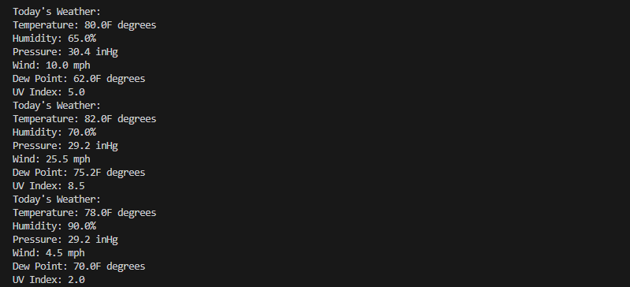

# Head First Design Patterns (2020 2nd Edition)

I have recently updated all the code for Head First Design Patterns for the 2nd edition of the book, released in December, 2020.

Download the code and compile and run from the command line, or load the code into project in Eclipse using Java 8 or higher.

Other links for the book are available on the book page at <a href="http://wickedlysmart.com/head-first-design-patterns/">wickedlysmart.com</a>.

# Software Engineering Update 

By forking this weather code your task will be to add a "Weather Today" display that shows Wind, Dew Point, and UV Index.

